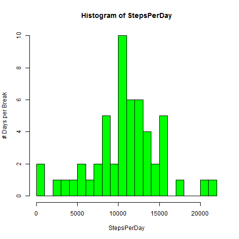

## Loading and preprocessing the data

1 & 2. Reading the data from local server, including headers, and ensuring the class of every column to avoid post process.
```{r}
ActivityData<- read.csv("C:/Users/204027408/Desktop/R Programs/Examples/RRAssigment1/RepData_Assessment1/activity.csv", header=TRUE, colClasses= c("numeric", "Date", "numeric"))

```
Reviewing the structure and data class.
```{r}
str(ActivityData)
```


## What is mean total number of steps taken per day?

For this part of the assignment, I am ignoring the missing values in the dataset.

I am creating an array with total number of steps per day, using tapply function.
```{r}
StepsPerDay<- tapply(ActivityData$steps, ActivityData$date, sum)
```

1. Making a histogram of the total number of steps taken each day
```{r}
hist(StepsPerDay, col="Green", ylab="# Days per Break", breaks=20)
```




I just learned that you can do a similar summary of steps per day with the function aggregate, but it creates a dataframe instead of an array.

```{r}
StepsPerDayAgg<- aggregate(steps~date, ActivityData, sum)
```

Now making a histogram of the data frame
```{r}
hist(StepsPerDayAgg$steps, col="Blue", ylab="# Days per Break", breaks=20)
```


2. Calculating and reporting the mean and median total number of steps taken per day

```{r}
MeanAD<- mean(StepsPerDay, na.rm=TRUE)
print (MeanAD)
MedianAD <- median(StepsPerDay, na.rm=TRUE)
print (MedianAD)
MeanADAgg<- mean(StepsPerDayAgg$steps, na.rm=TRUE)
MedianADAgg <- median(StepsPerDayAgg$steps, na.rm=TRUE)
```

The mean of steps per day is `r MeanAD`.
The median of steps per day is `r MedianAD`.

## What is the average daily activity pattern?


1. Making a time series plot (i.e. type = "l") of the 5-minute interval (x-axis) and the average number of steps taken, averaged across all days (y-axis).
Practicing with the two methods I learned: tapply generating an array, and aggregate, generating a data.frame.

```{r}
DAPattern<-tapply(ActivityData$steps, ActivityData$interval, mean, na.rm=TRUE)
plot(DAPattern, type = "l")
DAPatternAgg<- aggregate(steps~interval, ActivityData, mean)
plot(DAPatternAgg, type = "l")
abline(v=835, col="Blue", lwd=2)
```


2. Which 5-minute interval, on average across all the days in the dataset, contains the maximum number of steps?
```{r}
MaxInterval<-DAPatternAgg$interval[which.max(DAPatternAgg$steps)]
```

The 5-minute interval with the maximum number of steps, as you can see it also in the previous chart, is `r MaxInterval`.


## Imputing missing values

Noting that there are a number of days/intervals where there are missing values (coded as NA). The presence of missing days may introduce bias into some calculations or summaries of the data.

1. Calculating and report the total number of missing values in the dataset (i.e. the total number of rows with NAs)

```{r}
summary(ActivityData$steps)
NoDataRows<- sum(is.na(ActivityData))
```
The total number of rows with NAs is `r NoDataRows`

2. Devising a strategy for filling in all of the missing values in the dataset. The strategy does not need to be sophisticated. 

I will use the means of the activity data intervals, and use the command "impute" with the total mean.

3. Creating a new dataset that is equal to the original dataset but with the missing data filled in.

```{r}
ActData2 <- merge(ActivityData, DAPatternAgg, by="interval", suffixes=c("",".y"))
NoData <- is.na(ActData2$steps)
ActData2$steps[NoData] <- ActData2$steps.y[NoData]
ActData2 <- ActData2[, c(1:3)]
sum(is.na(ActData2))
class(ActData2)

library(Hmisc)
ActivityData2<- ActivityData
ActivityData2$steps<- with(ActivityData2, impute(steps, mean))
summary(ActivityData2$steps)
sum(is.na(ActivityData2))
class(ActivityData2)

```


4. Making a histogram of the total number of steps taken each day and Calculate and report the mean and median total number of steps taken per day. 
Do these values differ from the estimates from the first part of the assignment? What is the impact of imputing missing data on the estimates of the total daily number of steps?

Case 1: Using means of activity intervals:

```{r}
SPDNoNAs1<- aggregate(steps~date, ActData2, sum)
hist(SPDNoNAs1$steps, col="Blue", ylab="# Days per Break", breaks=20)
```


Case 2: Using one total mean:

```{r}
SPDNoNAs2<- aggregate(steps~date, ActivityData2, sum)
hist(SPDNoNAs2$steps, col="Green", ylab="# Days per Break", breaks=20)
```


Plotting Original with Case 1 and Case 2.  

```{r}
par(mfrow = c(3, 1))
hist(StepsPerDayAgg$steps, col="Green", ylab="# Days per Break", breaks=20)
hist(SPDNoNAs1$steps, col="Blue", ylab="# Days per Break", breaks=20)
hist(SPDNoNAs2$steps, col="Yellow", ylab="# Days per Break", breaks=20)
```


Now overlapping them all to see better the differences.

```{r}
hist(SPDNoNAs2$steps, main = paste("Comparing With NAs VS W/O NAs"), col="blue", xlab="Number of Steps", breaks= 20)
hist(StepsPerDayAgg$steps, main = paste("Total Steps Each Day"), col="red", xlab="Number of Steps", add=T, breaks= 20)
legend("topright", c("W/O NAs", "With NAs"), col=c("blue", "red"), lwd=5)
```


```{r}
MeanADAgg2<- mean(SPDNoNAs2$steps)
MedianADAgg2 <- median(SPDNoNAs2$steps)
```
Data set with NAs: Mean:`r MeanAD`. Median:`r MedianAD`.

Data set without NAs: Mean:`r MeanADAgg2`. Median:`r MedianADAgg2`.

We see an impact in the median of the data by filling out the NAs. 


## Are there differences in activity patterns between weekdays and weekends?
For this part the weekdays() function may be of some help here. Use the dataset with the filled-in missing values for this part.

1. Creating a new factor variable in the dataset with two levels – “weekday” and “weekend” indicating whether a given date is a weekday or weekend day.

```{r}
DType <- function(date) {
    if (weekdays(as.Date(date)) %in% c("Saturday", "Sunday")) {
        "weekend"
    } else {
        "weekday"
    }
}
ActivityData2$DType<- as.factor(sapply(ActivityData2$date, DType))
```

2. Making a panel plot containing a time series plot (i.e. type = "l") of the 5-minute interval (x-axis) and the average number of steps taken, averaged across all weekday days or weekend days (y-axis). See the README file in the GitHub repository to see an example of what this plot should look like using simulated data.


```{r}

DAPatternAgg2<- aggregate(steps~interval+ DType, ActivityData2, mean)
xyplot(steps ~ interval | DType, DAPatternAgg2, type = "l", layout = c(1, 2), 
    xlab = "5-minute Interval", ylab = "Number of steps")

```


There are clear differences on the number of steps on weekends and weekdays.


